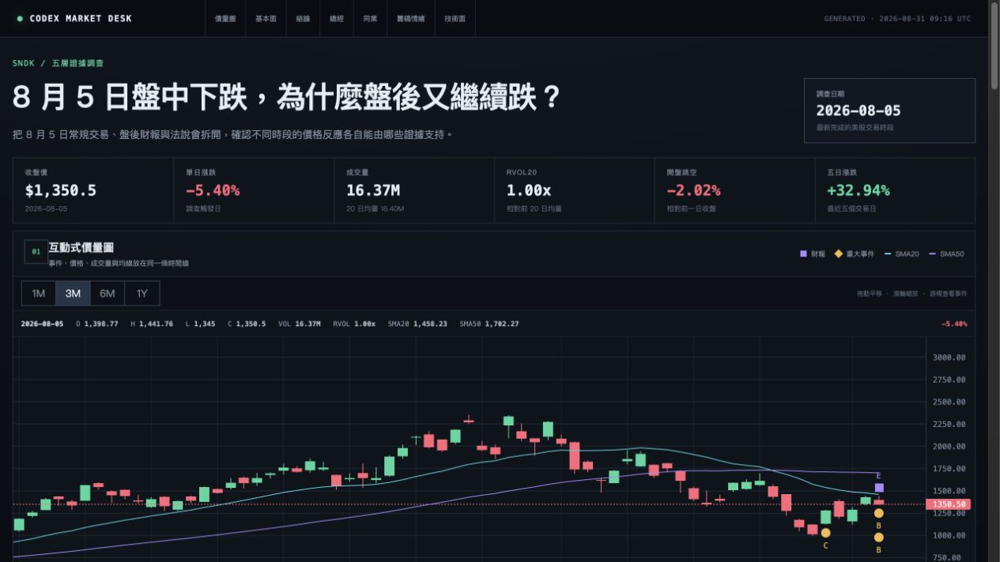

<div align="center">

# Stock Investigation Skill

**让 Codex 调查一只美股为什么异动，并生成带原始来源的交互式研究仪表盘。**

[](https://github.com/DistillAI888/stock-investigate-skill/tree/main/stock-investigation)
[](https://www.python.org/)
[](https://github.com/tradingview/lightweight-charts)
[](#本地环境)

[](https://github.com/DistillAI888/stock-investigate-skill/stargazers)
[](https://github.com/DistillAI888/stock-investigate-skill/commits/main)
[](https://github.com/DistillAI888/stock-investigate-skill/blob/main/LICENSE)

</div>

## 效果预览



图表会把价格、成交量、均线、财报和重大事件放在同一条时间线上，下方继续展示预期差、宏观背景、同行对比、资金情绪、技术结构与原始来源。

## 它能做什么

输入股票代码和异动日期，Codex 会按照固定框架收集证据，而不是只搜索几篇新闻就猜原因：

- 对比大盘、宏观市场代理、行业 ETF 和直接竞争对手
- 检查公司新闻、财报实际值与市场预期、业绩指引、电话会议和 SEC 文件
- 调查内部人交易、主要股东、机构持仓、空头数据、期权结构和流动性线索
- 计算 SMA20/50/200、RSI、MACD、ATR、布林带、区间位置和量价关系
- 区分盘前、盘中和盘后事件，避免把时间顺序弄反
- 将结论标记为「已确认」「推测」或「未知」
- 保留新闻、公司公告和监管文件的原始链接
- 生成可切换时间范围的交互式 K 线与成交量图表

最终得到的不是一句「可能因为财测不及预期」，而是一份可以自己复查证据的研究页面。

## 安装

在 Codex 中输入：

```text
使用 $skill-installer，从下面的 GitHub 地址安装 stock-investigation Skill：
https://github.com/DistillAI888/stock-investigate-skill/tree/main/stock-investigation
```

安装完成后，在下一轮对话中调用 Skill。

## 使用方法

最简单的用法：

```text
$stock-investigation SNDK 2026-08-05
```

股票代码为必填项。异动日期、基准指数、行业 ETF、同行公司、输出语言和具体调查问题都可以自定义。

例如：

```text
使用 $stock-investigation 调查 COHR 在 2026-07-30 的异动。
将它与 QQQ、SOXX、LITE 和 IIVI 对比，并生成简体中文 HTML 报告。
```

你也可以只提供股票代码，让 Codex 从近期走势中寻找值得调查的日期：

```text
$stock-investigation MU
```

## 调查框架

Skill 会依次检查五层证据：

1. **市场与宏观层**：这次波动是否只是跟随大盘、利率、美元、波动率或政策事件？
2. **行业层**：同行和行业 ETF 是否同时出现类似走势？
3. **公司基本面与事件层**：财报实际值和预期差是多少？附近是否有指引、法说会、公告、新闻或 SEC 文件？
4. **资金与情绪层**：是否存在内部人交易、大股东变化、空头、期权、被动资金或流动性事件？
5. **技术与量价层**：价格处于什么趋势和区间，波动与成交量是否确认这次异动？

所有事件都会与股价发生时间对齐。新闻出现在收盘后，就不会被当成当天盘中下跌的原因。当前的空头或期权快照也不会被拿来倒推历史事件。

## 输出内容

```text
reports/investigations/TICKER-YYYY-MM-DD/
├── evidence.json     # 原始证据与计算结果
├── analysis.json     # 结构化调查结论
├── report.md         # Markdown 研究报告
└── index.html        # 交互式可视化仪表盘
```

`index.html` 是一个静态网页，使用 [TradingView Lightweight Charts](https://github.com/tradingview/lightweight-charts) 绘制价量图。生成后不需要 React、Node.js、后端或构建步骤，直接用浏览器打开即可。

> 打开报告时需要联网加载图表库，以及访问报告内保留的原始资料链接。

## 本地环境

- Python 3.10 或更高版本
- `pandas`
- `yfinance`

```bash
python -m pip install -r requirements.txt
```

不需要另外申请行情 API Key。Codex 也可以自动建立项目专用的虚拟环境，并安装缺少的 Python 依赖。

## 适合谁

- 想调查美股突然大涨或大跌原因的普通投资者
- 想把晨报中的异常股票继续深挖的人
- 想用 Codex 建立可重复研究流程、但不想自己写代码的人
- 需要在视频、文章或研究笔记中展示证据链的人

## 重要说明

这个项目提供的是研究流程，不是交易信号，也不构成投资建议。价格异动附近出现一条新闻，并不代表两者已经存在因果关系；请阅读原始资料并自行判断。

## License

[MIT](LICENSE)
